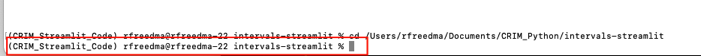
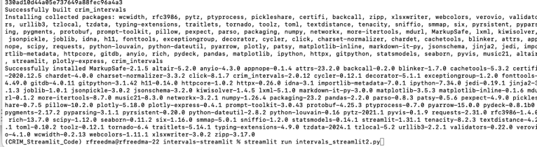
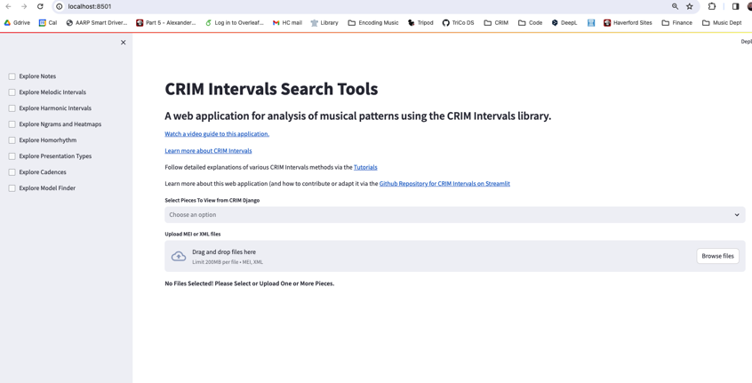
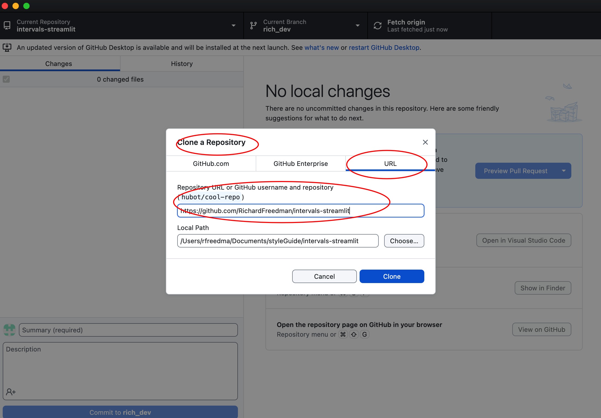
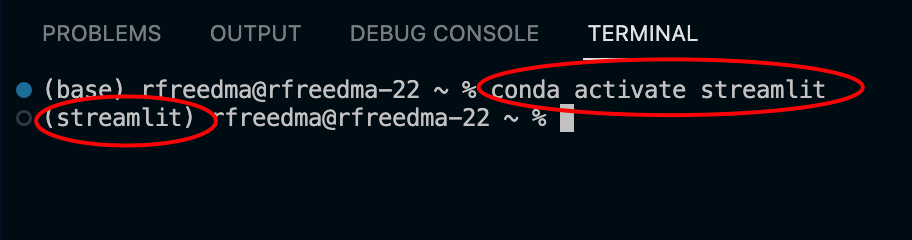
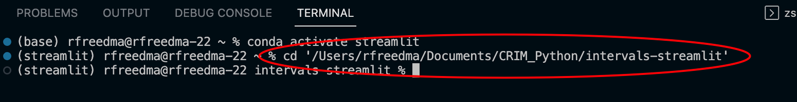

# intervals-streamlit

# A Streamlit Web Application for CRIM Intervals

Learn about CRIM Intervals here:  https://github.com/HCDigitalScholarship/intervals/tree/rich_dev_22

Learn about Streamlit functions here:  https://docs.streamlit.io/library/api-reference

## Use it Online at Streamlit.IO

[crimintervals](https://crimintervals.streamlit.app/)

This version is mostly stable, but with several users it can perform unexpectedly!

## Run it Locally on your Own Computer in a Virtual Environment

This version runs well, and is extremely fast!

### 1. Get Anaconda Navigator to Manage Virtual Environments 

"Virtual Environments" are in effect small computing worlds on your computer.  They allow you to run special sets of tools in a way that keeps them isolated from all other programs.  Different programs require different 'dependencies', and different versions of these dependencies.  So keeping them separate is a good idea.

If you are new to virtual environments, one good solution is to manage environments is with **Anaconda Navigator**.  [Download it for your machine for free](https://www.anaconda.com/download).  [Learn more about Anaconda Navigator](https://learning.anaconda.cloud/).  


### 2. Create a New Virtual Environment

Here are the steps:

- A. Click "+ create" at the bottom of Navigator
- B. Name it (anything you like, but perhaps "crim_streamlit")
- C. On the **Python** dialogue, select "**3.10.13**" or any version that starts with "3.10"
- D. Click "create" in the dialogue, and wait a minute or two . . 


### 3. Create a Project Folder on your Computer

Now you will need to create a dedicated folder on your computer where you will keep the code for the CRIM Intervals Streamlit application.

- Make a **new folder** in the **Documents** folder on your machine.  You can name it as you like, but something simple like "**CRIM Streamlit Code**" will do.  
- You will not be editing any of the files here, but instead you will sync this folder to an online repository on GitHub.  Don't worry, this won't put anything strange on your computer!
- Make sure you know where to find this folder, since you will need to point to it in the next step

### 4. Return to Anaconda Navigator and your Virtual Env

- Make sure that the new environment you created is the active one (see image).

- Click on the arrow next your enviroment and select **Open Terminal**


- This will create an interactive 'Terminal' session, through which you can write commands to your computer that will download the code you need.
- You should see something like this, with the **name of your environment**, followed by the **name of your computer**, all follwed by a **symbol and space for your cursor**:

```
(CRIM_Streamlit_Code) rfreedma@rfreedma-22 ~ % 
```


### 5. Get the Code from Github via the Terminal

- Now you will first need to make sure you have the 'git' code that will allow you to request code from github.  Install it by pasting the following into your terminal: 

```
conda install git
```


- This will in turn ask you to confirm that you want to install this software.  Type **y** for 'yes'.
- You will see the code install and then something to confirm success, like the following:


### 6. Change the Terminal to Point to your New Project Folder

- Now find the **new project folde**r** (which we will call a 'directory') you created in Step 3 above.  We will enter the 'path' to that directory in the terminal, preceeded by "cd", like this:

```
cd Documents/Projects/MyProject
```

- Your path might look like this:


```
/Users/rfreedma/Documents/CRIM_Python/intervals-streamlit
```

- The whole command would be (remember ONE space between 'cd' and the path to your folder!)


```
cd /Users/rfreedma/Documents/CRIM_Python/intervals-streamlit
```

Type that into the Terminal and press enter.  Now the terminal command prompt should include the name of your directory:




### 7.  Sync Your Folder to the GitHub Repository for CRIM Intervals Streamlit

- Now you will issue the command to 'clone' the code and put it in your Project Folder.  Don't worry, you can always delete this, and it will have no effect on any other software on your computer!

- At the terminal prompt paste in the following (remember just one space between each element), and press Enter/Return:

```
git clone https://github.com/RichardFreedman/intervals-streamlit.git
```

- This should only take a few seconds, but you will see the following confirmation:

 

-  If you want to see the files, simply type 'ls' (which will list all the files)

### 8. Install the Requirements for CRIM Intervals Streamlit

- Now you need to install the various dependencies that make Streamlit and CRIM Intervals work together.  Copy and paste the following into your terminal:

```
pip install -r requirements.txt
```

- There will be a lot of activity for a minute or two as all the libraries are installed.  But eventually you will return to the command prompt.  But meanwhile you might see this:




- Congratulations, you are ready to run Streamlit!

### 9.  Run Streamlit CRIM Intervals

- At the command prompt in the terminal, type the following:

```
streamlit run intervals_streamlit2.py
```

- After a brief 30 seconds or so, Streamlit should start in a browser window.  



- The terminal will also show you the local IP address to use to access the application.


### 10.  Shut Down and Restart

- When you are finished you can simply close your browser window, and quit Anaconda Navigator and the Terminal application

- If you want to restart another time you will need to:

1.  Open Navigator
2.  Click on your Virtual Environment to activate it
3.  Open Terminal (as shown above)
4.  'Change Directory' to your project folder (see above) using 'cd' and the rest of the path to your folder
5.  Start the Streamlit App as shown in step 9


* **Install Jupyter Notebook or Visual Studio Code** if they are not already in that environment.

From 

* **Clone the Streamlit for Intervals repository to your local machine**.  Github Desktop is a good way to do this:  https://desktop.github.com/.  You will need to look for Clone a Repository under the File menu for GitHub Desktop, then paste in this url:  https://github.com/RichardFreedman/intervals-streamlit and provide a location on your own computer where you would like the files to be saved.



* From within your Streamlit virtual environment on Anaconda Navigator, and using VS Code or Jupyter Notebook, **open a new Terminal window, and 'acvitate' your environment**.  When you start the terminal you will probably see that you are running on 'base', but you will need to type `conda activate streamlit` (the last word will be the name of the environment you created above) at the terminal prompt:



If you are successful you will see that you are now running on 'streamlit' (or whatever you call your environment).

* Make sure that terminal (and thus VS Code and Jupyter Notebooks) are looking to the local directory on your computer where you downloaded the Streamlit repository in the step above.  At the terminal prompt, type (for instance) `cd '/Users/rfreedma/Documents/CRIM_Python/intervals-streamlit'`



* **Install the 'requirements' for Streamlit Intervals**.  This is file is part of the streamlit intervals GitHub repository, and which was added to your local folder when you cloned the respository in the step above.  So in the terminal type `pip install -r requirements.txt`

This might take a minute or two, and you will see a long and rapdily moving display of content in the Terminal window.  Eventually the process will stop and you will see the prompt again.

* Now you are ready to start the Streamlit for Intervals application via the terminal with `streamlit run intervals_streamlit2.py`.  Your internet browser will launch automatically, and then you can use the app!

